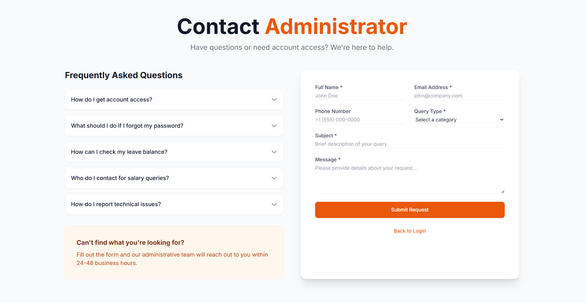
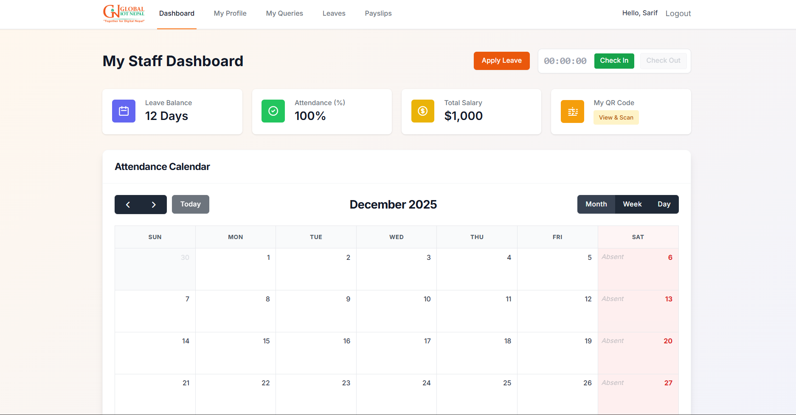
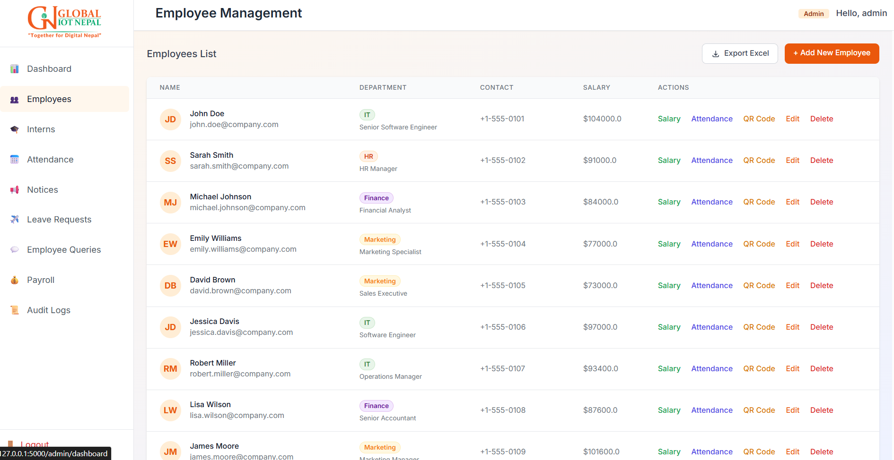
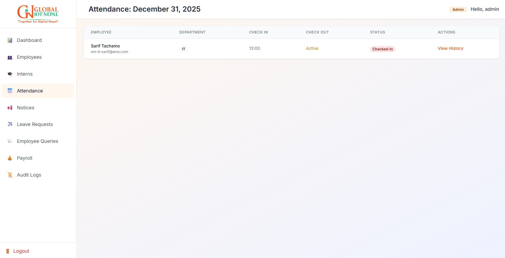
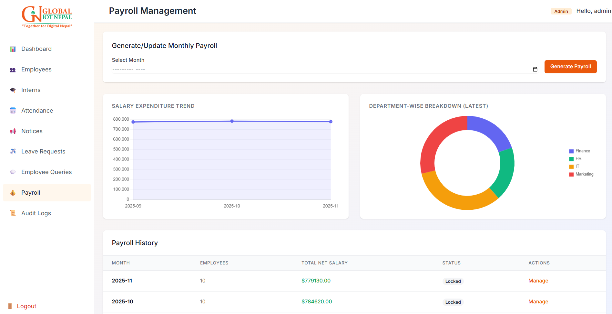
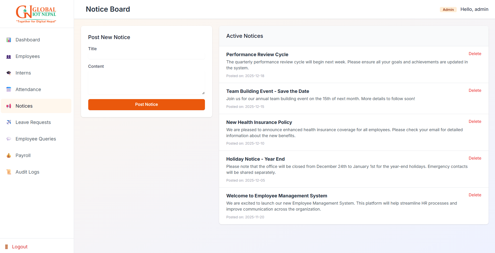
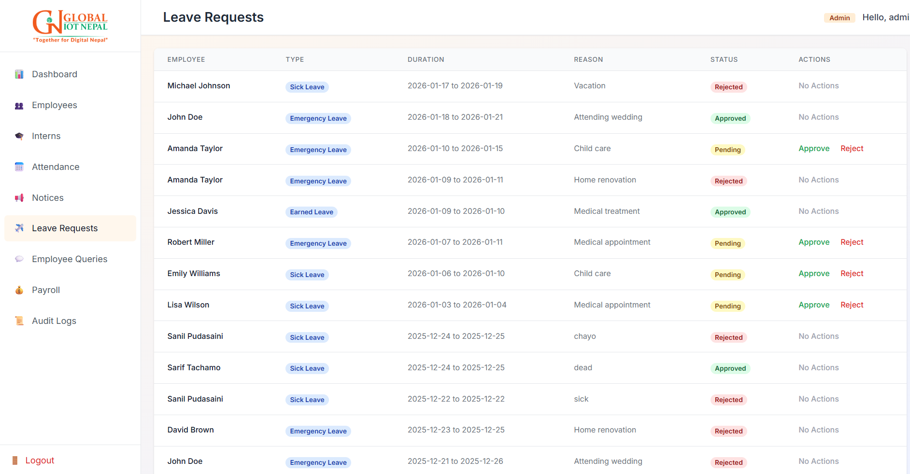
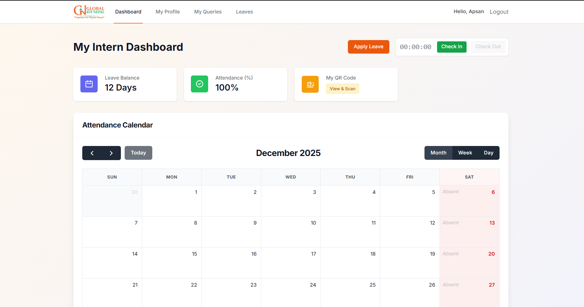
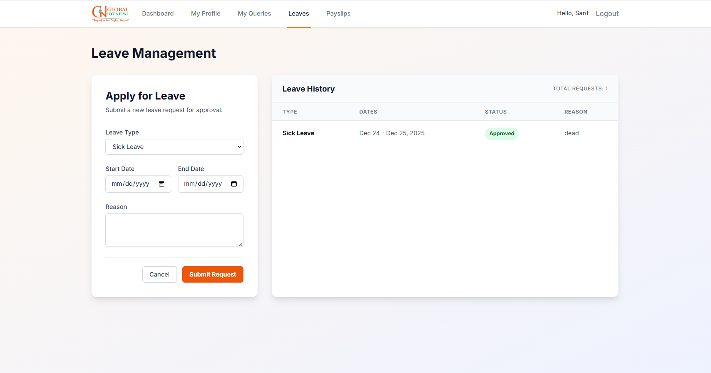
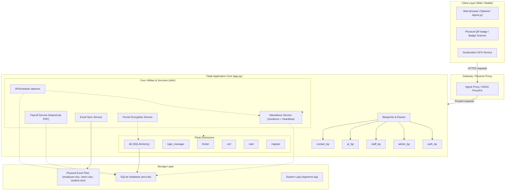

# Enterprise Management System (EMS)

Employee and Enterprise Management System (EMS) built on a Flask web framework. A complete, role-based solution (Admin, Employee, Intern, and Student) designed for attendance logging, automated geofenced time tracking, support ticket messaging, payroll scheduling, financial bookkeeping, and local database-to-Excel synchronization.

---

## Description
The Enterprise Management System (EMS) is an corporate administration dashboard that bridges physical attendance verification with automated digital workflows. Users can log in using traditional credentials or via their physical QR Badge generated by the system. 

The system prioritizes security and accountability, enforcing strict GPS geofencing, single-session concurrency, automated lockout policies, and database encryption. Additionally, an asynchronous scheduling engine handles automated check-outs, reminders, and report generation, while bidirectional Excel synchronization keeps local records up-to-date.

---

## Screenshots / Demo

Below are preview screenshots of the system dashboards. All screenshots are available under the [static/images/](file:///d:/BACKUP's/emss/EMS_Update%20may15%201_05%20checkin%20feature/EMS_Update/ems%202.0/static/images) directory.

### Auth Portal and Onboarding
| Gateway Login Screen | Support / Request Access |
| :---: | :---: |
|  |  |

### System Administrator Views
| Admin Dashboard | Employee Directory | Attendance Monitoring |
| :---: | :---: | :---: |
|  |  |  |

| Payroll and Batch Runs | Broadcast Notices | Leave Approvals |
| :---: | :---: | :---: |
|  |  |  |

### Employee and Intern Portals
| Employee Main Dashboard | Intern Dashboard | Leave Application Form |
| :---: | :---: | :---: |
|  |  |  |

---

## Features

### 1. Role-Based Portals and Access Control
- **Admin**: Oversees staff lists, tracks real-time attendance, issues notices, reviews leaves and overtime requests, calculates payrolls, tracks revenue, reviews system audit logs, responds to support queries, and edits global office parameters.
- **Employee**: Accesses daily metrics, performs geofenced check-in/out, logs activity heartbeats, requests leaves or overtime, views payslips, submits contact/support inquiries.
- **Intern**: Accesses dedicated dashboard tracking active hours, allowances, tasks, and profile settings.
- **Student**: Designed for students tracking workshop timelines, payment history, fee collections, and workshop progress.

### 2. Geo-Location and IP Geofencing
- **Multi-Geofence Support**: System validates user coordinates (Latitude/Longitude) against permitted coordinates using the Haversine formula.
- **Location Bypasses**: Admins can issue temporary (e.g. 24-hour) bypasses for employees working remotely or off-site.
- **IP Restrictions**: Limits check-in to specific public office IP ranges.

### 3. Persistent QR Badge System
- **Digital ID Badge**: Every user profile features a persistent physical QR identity badge (valid for 6 months).
- **Fast Scanner Logins**: Admins or attendance scanners can read the QR badge, triggering a secure location-verified check-in/out workflow.

### 4. Financial and Payroll Operations
- **Batch Processing**: Process collective monthly payrolls dynamically calculating base rates, allowances, overtime hours, LOP (Loss of Pay) deductions, and taxes.
- **Auto-Generated Payslips**: Outputs professional PDF payslips (via ReportLab and xhtml2pdf).
- **Financial Balance Sheets**: Compiles monthly summaries (Gross Revenue vs Expenses vs Net Profit margins).

### 5. Bidirectional Excel Synchronization
- Automatically updates physical Excel files (`employee.xlsx`, `intern.xlsx`, and `student.xlsx` in `database/`) when profiles are created or modified in the database.
- Supports bulk seeding from Excel files.

### 6. Automated Background Scheduling
- Powered by an APScheduler daemon and daemonized monitoring threads:
  - **Auto-Checkout**: Safely clocks out users at a designated time (e.g. 6 PM) if they forget to do so.
  - **Email Alerts**: Dispatches reminders prior to auto-checkout, OTP codes, notice broadcasts, and login alerts.
  - **Database Backups**: Triggers regular database snapshots.

---

## Tech Stack

- **Backend**: Python 3, Flask (Factory pattern)
- **Frontend**: HTML5 Jinja2 Templates, Tailwind CSS (via CDN), Alpine.js
- **Database**: SQLite (via Flask-SQLAlchemy)
- **Database Migrations**: Flask-Migrate (Alembic)
- **Scheduler and Services**: APScheduler, PyTZ
- **Document Processing**: pandas, openpyxl, ReportLab, xhtml2pdf
- **Security and Cryptography**: cryptography (Fernet symmetric encryption), Flask-Talisman, Flask-WTF, Flask-Limiter, Argon2/Werkzeug hashing

---

## Project Architecture



---

## Installation

### Prerequisites
- Python 3.10+
- SQLite3

### Step-by-Step Guide

1. **Clone the repository**:
   ```bash
   git clone <repository-url>
   cd ems-2.0
   ```

2. **Establish virtual environment**:
   ```bash
   python -m venv .venv
   ```

3. **Activate the environment**:
   - **Windows (CMD/Powershell)**:
     ```powershell
     .venv\Scripts\activate
     ```
   - **Linux/macOS**:
     ```bash
     source .venv/bin/activate
     ```

4. **Install dependencies**:
   ```bash
   pip install -r requirements.txt
   ```

5. **Set up configurations**:
   - Duplicate the environment config template to create your `.env` file:
     ```bash
     copy .env.example .env
     ```
   - Add your local SMTP credentials and customized values inside `.env`.

6. **Initialize the database and schema**:
   ```bash
   python database/reset_db.py
   ```
   *This drops existing tables, creates the latest schemas, and automatically seeds initial accounts.*

---

## Configuration

Global settings are loaded from `.env` and map to properties inside [config.py](file:///d:/BACKUP's/emss/EMS_Update%20may15%201_05%20checkin%20feature/EMS_Update/ems%202.0/config.py):

| Variable Name | Description | Default / Example |
| :--- | :--- | :--- |
| `SECRET_KEY` | System secret used for signing session cookies. | `dev-secret-key-change-in-prod` |
| `ENCRYPTION_KEY` | Symmetric Fernet key for encrypting sensitive fields. | *Generated if not supplied.* |
| `FLASK_ENV` | Application environment state. | `development` / `production` |
| `DATABASE_URL` | SQLAlchemy connector URI. | `sqlite:///database/ems.db` |
| `MAIL_SERVER` | SMTP Mail server domain. | `smtp.gmail.com` |
| `MAIL_USERNAME` | SMTP Username/email. | `example@gmail.com` |
| `MAIL_PASSWORD` | SMTP password/app code. | `xxxx xxxx xxxx xxxx` |
| `NGROK_AUTHTOKEN` | Tunnel token if running public proxy testing. | `<token>` |
| `NGROK_DOMAIN` | Static ngrok domain. | `<domain>.ngrok-free.dev` |
| `WEBSITE_URL` | Public callback domain. | `https://<domain>.ngrok-free.dev` |

---

## Usage

### Running Locally (Direct Dev Server)
Start the dev server locally using the built-in development setup in `app.py`:
```bash
python app.py
```
The app will run on `http://127.0.0.1:5000`.

### Running with Public Ngrok Tunnel
To test GPS geolocation/location services on mobile devices, use the ngrok wrapper which cleans up conflicts and sets up an HTTPS reverse-proxy tunnel:
```bash
python run_with_ngrok.py
```
This automatically initializes the ngrok agent, sets the external callback URLs, and outputs the public HTTPS tunnel link.

### Seeded Credentials
When you run the database setup, it seeds the following roles for testing:

- **Admin**: `admin@ems.com` / `AdmiN@369` (Employee ID: `EMS-001`)
- **Employee**: `employee@ems.com` / `EmployeE@123` (Employee ID: `EMP-001`)
- **Intern**: `intern@ems.com` / `InterN@456` (Employee ID: `ITN-001`)
- **Student**: `student@ems.com` / `StudenT@789` (Employee ID: `STD-001`)

---

## Folder Structure

```
ems 2.0/
├── database/            # Database configurations & Excel sheets
│   ├── models.py        # SQLAlchemy schema declarations
│   ├── ems.db           # Local SQLite instance
│   ├── reset_db.py      # Clears and initializes tables
│   ├── seed.py          # Seeds initial roles and configurations
│   ├── sync_db.py       # Direct schema updater script
│   └── employee.xlsx, intern.xlsx, student.xlsx # Backup sheets
├── routes/              # Blueprint modular routes
│   ├── auth.py          # Logins, OTPs, QR Badging, lockout checks
│   ├── admin_routes.py  # Admin panels (Staff management, payroll, reports)
│   ├── staff.py         # Dashboards for Employee, Intern, and Student profiles
│   ├── contact_routes.py# User support ticketing
│   └── qr_routes.py     # Employee QR Badges, locations, auto-login workflows
├── static/              # Assets and compiled directories
│   ├── css/             # Custom page stylesheets
│   ├── images/          # Portal screenshots, logo, and active badge folders
│   └── js/              # Frontend scripting
├── templates/           # HTML templates
│   ├── admin/           # Admin pages (KPI dashboards, settings, directories)
│   ├── auth/            # Auth pages (OTP validation, lockout page, resets)
│   ├── employee/        # Employee dashboards, profiles, leave applications
│   ├── qr/              # Scanning, location verification layouts
│   ├── emails/          # Templates for SMTP messages
│   └── base.html        # Shell structure
├── utils/               # Underlying services & algorithms
│   ├── attendance_service.py # Time log trackers, auto-checkout, heartbeats
│   ├── excel_sync.py         # Bidirectional sync between SQLite and Excel files
│   ├── financial_service.py  # Revenue-expense profit trackers
│   ├── location_service.py   # GPS / Geolocation / distance validation
│   ├── payroll_service.py    # Deductions, gross/net pay, ReportLab payslips
│   ├── qr_service.py         # QR code badge generators
│   └── scheduler_service.py  # APScheduler setup (backups, checkouts, mail)
├── app.py               # Main App factory (Talisman headers, error handlers)
├── config.py            # Development & Production environment configurations
├── extensions.py        # Shared extensions (SQLAlchemy, LoginManager, Limiter, Mail)
├── requirements.txt     # Python requirements manifest
├── run_with_ngrok.py    # Dev server with automated ngrok setup
├── wsgi.py              # Production WSGI application target
└── .env                 # Session settings, ports, and SMTP configuration
```

---

## Security Features

The platform includes multiple defense layers:

- **AES Field-Level Encryption**: Encrypts sensitive columns like `bank_account`, `pan_number`, `personal_email`, and `phone` at the database level using Cryptography's `Fernet` (AES encryption).
- **Single-Session Concurrency**: Revokes old sessions when a non-admin user logs in from a new browser or machine, preventing simultaneous account usage.
- **Auto-Logout/Global Session Reset**: Compares a boot ID against current cookie tokens; restarting the server automatically terminates all active sessions to secure data.
- **Geofence Constraints**: Demands device GPS data and matches it against allowed corporate coordinates before permitting check-in or checkout.
- **Talisman Security Engine**: Sets strict security headers:
  - **Content Security Policy (CSP)**: Curated nonces and whitelisting preventing XSS.
  - **HSTS / Force HTTPS**: Demands encrypted channel transport.
  - **Cookie Guards**: `HttpOnly`, `Secure` (in production), and `SameSite=Lax`.
- **Brute Force Lockout Policy**: Enforces rate limiting with `Flask-Limiter` and blocks IP addresses (`BlockedIP`) after multiple failed attempts.
- **CSRF Token Verification**: Protects all transaction forms via Flask-WTF CSRF validation.

---

## Testing

The project has a suite of validation scripts located in [tests/](file:///d:/BACKUP's/emss/EMS_Update%20may15%201_05%20checkin%20feature/EMS_Update/ems%202.0/tests):

- **Mock Views Validation**: [test_all.py](file:///d:/BACKUP's/emss/EMS_Update%20may15%201_05%20checkin%20feature/EMS_Update/ems%202.0/tests/test_all.py) logs in a dummy administrator and fires test request contexts across the directory endpoints.
- **Payroll Checkers**: [test_payrolls.py](file:///d:/BACKUP's/emss/EMS_Update%20may15%201_05%20checkin%20feature/EMS_Update/ems%202.0/tests/test_payrolls.py) verifies intern and employee salary snapshots, gross totals, and periods.
- **Error Handlers**: [test_error.py](file:///d:/BACKUP's/emss/EMS_Update%20may15%201_05%20checkin%20feature/EMS_Update/ems%202.0/tests/test_error.py) checks that proper status codes (e.g. 403, 404, 500) and custom error pages are returned.

### To Run Validation Scripts:
Ensure your environment is active, then execute:
```bash
python tests/test_all.py
python tests/test_payrolls.py
```

---

## Future Improvements

- **Mobile Companion App**: Native apps utilizing device GPS sensors and QR scanner libraries for faster access.
- **Biometric Integration**: Support for fingerprint/face-identification scanners for physical check-in.
- **Advanced Financial Modeling**: Integrations with external accounting software APIs (such as QuickBooks or Xero).
- **Automated Work Logging**: Automated tracking of active desktop windows to automatically log specific user productivity benchmarks.
- **Database Scalability**: Support for migrating to dedicated enterprise databases like PostgreSQL or MySQL for high-concurrency environments.
